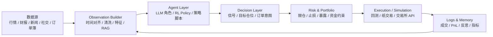

# 开源交易 Agent 构建方式调研报告

调研日期：2026-05-29  
调研范围：LLM 多智能体交易框架、强化学习交易环境、可连接交易所的自动化交易机器人、预测市场 Agent。  
重要说明：本文只做工程调研，不构成投资建议；多个项目的 README 也明确强调研究、教育或自担风险。

## 1. 摘要

当前开源交易 Agent 主要不是“一个大模型直接下单”，而是三类工程形态：

1. **LLM 多智能体投研/决策系统**：把交易前流程拆成基本面、新闻、情绪、技术面、研究员辩论、交易员、风控、组合经理等角色，最终输出信号、仓位建议或模拟订单。代表项目包括 [TradingAgents](https://github.com/tauricresearch/tradingagents)、[AI Hedge Fund](https://github.com/virattt/ai-hedge-fund)、[FinRobot](https://github.com/AI4Finance-Foundation/FinRobot)、[LiveTradeBench](https://github.com/ulab-uiuc/live-trade-bench)。
2. **RL / Gym 式交易环境**：把市场抽象成 MDP，Agent 接收状态向量，输出买卖/仓位动作，环境按价格序列、手续费、账户状态计算奖励。代表项目包括 [FinRL](https://finrl.readthedocs.io/en/latest/tutorial/Introduction/SingleStockTrading.html)、[TensorTrade](https://github.com/tensortrade-org/tensortrade)。
3. **可实盘连接的交易机器人框架**：核心是交易所连接器、策略脚本、风控、回测、dry-run、live-run，不一定内置 LLM。代表项目包括 [Freqtrade](https://github.com/freqtrade/freqtrade)、[Hummingbot](https://github.com/hummingbot/hummingbot)、[Polymarket Agents](https://github.com/Polymarket/agents)。

共同趋势是：**Agent 负责推理和策略意图，环境负责提供 point-in-time 数据、账户状态和执行反馈，风控/组合层负责把建议转成可执行动作**。真正能安全落地的系统都会把“研究信号”和“下单执行”分开。

## 2. 通用架构

工程上通常分为五层：

- **数据层**：行情、OHLCV、订单簿、资金费率、持仓量、财报、SEC 文件、新闻、Reddit/StockTwits/Twitter 情绪、宏观指标、预测市场事件元数据。
- **观测层**：把多源数据整理成 Agent 可消费的 prompt、JSON、DataFrame、状态向量或窗口特征。
- **推理层**：LLM 角色工作流、RL policy、传统策略脚本或混合模型。
- **风控/组合层**：检查仓位、资金、波动率、流动性、最大回撤、单票/单市场限制。
- **执行层**：回测撮合、模拟交易、dry-run、交易所 REST/WebSocket、订单签名与发送。

## 3. 代表项目对比

| 项目 | 类型 | 构建方式 | 环境与可接收信息 | 能力与边界 |
|---|---|---|---|---|
| TradingAgents | LLM 多智能体股票交易框架 | 使用多角色 LLM 工作流：基本面、情绪、新闻、技术分析师，牛/熊研究员辩论，交易员，风控与组合经理；依赖 LangChain/LangGraph、多 LLM Provider、yfinance、Alpha Vantage 等 | 公司财务、新闻标题、StockTwits、Reddit、宏观新闻、技术指标、历史决策记忆、组合风险 | 输出交易决策、模拟交易、风险评估；有 decision log 和 checkpoint；定位研究用途，不是投资建议 |
| AI Hedge Fund | LLM 投资团队 / 组合决策 PoC | 19 个 Agent，包括价值/成长/宏观投资人画像、估值、情绪、基本面、技术面、Risk Manager、Portfolio Manager；LangChain/LangGraph + Poetry + Web App/CLI | Financial Datasets API、LLM API、本地 Ollama 可选、指定 ticker 和起止日期、技术/基本面/情绪数据 | 生成信号、组合经理给出订单、可回测；README 明确“不实际交易” |
| FinRobot | 通用金融 Agent 平台 | Perception-Brain-Action 三段式；Smart Scheduler 负责选择/调度不同金融 LLM Agent；包含 agents、data_source、functional 三类模块 | Finnhub、FinnLP、FMP、SEC、yfinance、市场数据、新闻、经济指标、多模态金融数据 | 交易、组合调整、报告生成、提醒；更像金融 Agent 开发平台，不只服务交易 |
| LiveTradeBench | LLM 交易 Agent 实时评测平台 | FastAPI 全栈；fetchers、agents、accounts、systems、backtest 分层；可同时运行多个 LLM Agent | 股票价格与公司信息（Yahoo Finance）、Polymarket CLOB、NewsAPI/Finnhub 新闻、Reddit 情绪、账户和历史表现 | 实时运行、监控、benchmark、回测分析；重点是评价 LLM 在真实市场流中的表现 |
| Polymarket Agents | 预测市场 Agent 开发框架 | Polymarket API + Gamma API + Chroma/RAG + CLI；模块化 API、对象模型、脚本 | 预测市场列表/事件/盘口、新闻、web search、向量库、本地数据、钱包私钥和 USDC | 查询市场、检索新闻、调用 LLM、签名并执行 Polymarket 交易；需要钱包和密钥安全治理 |
| FinRL / FinRL-Meta | 强化学习交易环境 | OpenAI Gym 风格 MDP：reset/step/reward；可接 stable-baselines 等算法 | 账户余额、持仓、OHLCV、成交量、技术指标、基本面、社交/情绪信号等状态空间 | 训练股票/组合/加密货币等 RL Agent；动作是买卖股数或资产权重；奖励常用组合价值变化 |
| TensorTrade | 模块化 RL 交易框架 | TradingEnv 由 Observer、Agent、ActionScheme、RewardScheme、Portfolio、Exchange、Broker、DataFeed 组合 | 窗口特征、钱包/持仓、交易数据、模拟交易所、手续费配置 | 训练/评估 RL Agent；默认 BSH（买/卖/持有）动作与 PBR 奖励；强调手续费会显著影响收益 |
| Freqtrade | 加密货币交易机器人 | Python 策略接口 + 交易所适配 + SQLite 持久化 + WebUI/Telegram；支持 backtesting、hyperopt、dry、live、FreqAI | OHLCV、orderbook、ticker、market metadata、funding rate、历史/缓存行情、策略指标 | 回测、参数优化、dry-run、live trading、策略管理；不是 LLM Agent，但提供成熟执行与验证框架 |
| Hummingbot | 高频/做市/套利机器人框架 | Client/API/Gateway/Connector/Strategy V2；REST/WebSocket 标准化连接器，支持 CEX、CLOB DEX、AMM DEX | 订单簿、成交、余额、行情、CEX/DEX/AMM 状态、链上钱包或 API key | 做市、套利、跨交易所策略、DEX 交互、多机器人部署；更偏执行基础设施，可被 AI/MCP 控制 |

## 4. 他们的环境是什么样子

### 4.1 LLM Agent 环境

LLM 类项目的“环境”不是 Gym 的单一状态向量，而是一个**工具增强的上下文工作区**：

- **输入上下文**：ticker、日期、市场快照、公司财报、新闻、社交媒体、技术指标、历史决策、已有仓位。
- **工具接口**：行情 API、财务数据 API、新闻 API、RAG/向量库、Web search、文件/日志、回测器。
- **工作流状态**：每个角色的中间报告、辩论记录、风险评估、最终组合经理意见。
- **执行反馈**：模拟成交、实际收益、alpha vs benchmark、历史决策反思。

TradingAgents 的 decision log 会把历史决策和实现收益写入本地记忆，下一次同 ticker 分析会把近期经验注入组合经理 prompt。LiveTradeBench 则把实时价格、新闻和社交情绪持续流入系统，用账户模块跟踪组合表现。

### 4.2 RL / Gym 环境

RL 类项目的环境更标准化：

- **状态 `s`**：余额、持仓、价格、OHLCV、成交量、技术指标、社交/情绪数据、风险信号等。
- **动作 `a`**：买/卖/持有、买卖股数、目标仓位、资产权重、做多/做空。
- **奖励 `r`**：组合价值变化、收益率、风险调整收益、Sharpe、回撤惩罚等。
- **转移**：按历史时间序列推进，执行动作后更新现金、持仓、费用和下一期状态。

FinRL 文档明确把股票交易建模为 MDP，并使用 OpenAI Gym 风格环境模拟真实市场；TensorTrade 进一步把 ActionScheme、RewardScheme、Observer、Exchange 等做成可插拔组件。

### 4.3 实盘机器人环境

Freqtrade、Hummingbot 这类系统的环境更接近生产交易基础设施：

- **事件循环**：按 candle close、tick、订单簿更新或策略周期触发。
- **连接器**：用 REST/WebSocket 统一不同交易所、CEX/DEX、现货/永续/AMM。
- **账户状态**：余额、挂单、成交、手续费、持仓、PnL。
- **模式切换**：backtesting、hyperopt、dry-run、live trading。
- **控制面**：CLI、WebUI、Telegram、API、MCP。

这类系统不一定“会思考”，但它们解决了 LLM Agent 最缺的执行、风控、监控和交易所适配问题。

## 5. Agent 可以接收到的信息

按信息类型归纳如下：

| 信息类型 | 典型字段 | 用途 |
|---|---|---|
| 价格与成交 | OHLCV、ticker、成交量、收益率、波动率 | 技术分析、RL 状态、趋势/均值回归判断 |
| 微观结构 | bid/ask、spread、orderbook depth、成交、滑点 | 做市、套利、执行质量、流动性风险 |
| 衍生品/链上 | funding rate、open interest、永续合约价格、AMM 池状态 | 永续交易、杠杆风险、DEX 策略 |
| 基本面 | 财报、估值、利润、现金流、SEC 文件、内部人交易 | 长周期股票分析、估值和质量判断 |
| 文本信息 | 新闻、宏观事件、社交媒体、Reddit、StockTwits、web search | 情绪、事件驱动、预测市场判断 |
| 组合与账户 | cash、positions、orders、PnL、drawdown、exposure、risk limits | 仓位控制、组合再平衡、风控 |
| 历史记忆 | 过往决策、实现收益、反思、策略表现 | 经验复用、提示词上下文、避免重复错误 |
| 元数据 | 市场是否可交易、费用、最小下单量、精度、退市/到期时间 | 下单合法性、执行约束 |

## 6. Agent 可以做什么

能力按风险从低到高排列：

1. **投研与解释**：生成公司分析、新闻摘要、情绪判断、风险提示、财报解读。
2. **信号生成**：输出 buy/sell/hold、long/short、置信度、目标价、alpha signal、情绪分数。
3. **组合建议**：给出目标权重、再平衡建议、限仓建议、风险预算。
4. **回测与训练**：在历史数据上训练 RL policy、评估策略、做 walk-forward、调参。
5. **纸交易 / 模拟执行**：在 dry-run 或模拟交易所里下单并记录 PnL。
6. **实盘执行**：通过交易所 API、钱包签名或 Polymarket DEX 执行订单。
7. **监控与运维**：WebUI/Telegram/API/MCP 控制机器人、查看状态、停止策略、导出报表。

成熟项目通常不会让 LLM 直接拥有无限下单权限，而是让它输出**结构化意图**，再由风控和执行层校验。

## 7. 关键工程模式

### 7.1 角色拆分优于单提示词

TradingAgents 和 AI Hedge Fund 都把交易决策拆成多个角色。这样做的好处是每个 Agent 的输入、输出、责任更清晰，也便于记录中间证据。缺点是延迟、成本和不确定性更高。

### 7.2 风控层独立存在

Risk Manager / Portfolio Manager 是多数 LLM 交易系统的关键边界。分析 Agent 可以“看多”，但最终是否下单、下多少、是否超过暴露限制，应由组合层决定。

### 7.3 数据必须 point-in-time

Freqtrade 文档专门提醒 backtesting 中的 lookahead bias：回测时如果策略读到了未来数据，结果会虚高，实盘会失效。这个问题在 LLM Agent 中更严重，因为新闻、财报修订、网页搜索结果都可能带有未来信息。

### 7.4 输出要结构化

可靠系统会要求 Agent 输出 JSON、固定字段、目标权重或订单意图，而不是自然语言段落直接进入执行层。必要字段包括 action、symbol、side、quantity/weight、confidence、evidence、risk_reason、data_quality。

### 7.5 回测、dry-run、live 必须隔离

Freqtrade、Hummingbot 的经验说明，生产系统应明确区分历史回测、模拟撮合、纸交易和实盘交易。LLM 多智能体系统如果没有这个分层，很容易把“研究 demo”误用成“自动交易系统”。

### 7.6 记忆只能辅助，不能替代验证

TradingAgents 的历史决策记忆和 FinMem 类研究说明，记忆可以帮助 Agent 复用经验；但记忆也可能引入过拟合和错误归因，所以仍需要明确的评估指标、样本外验证和风控约束。

## 8. 风险与局限

- **LLM 幻觉**：可能编造基本面解释、误读新闻、过度自信。
- **数据质量**：免费行情源延迟、缺失、拆股复权错误、新闻时间戳不准都会影响结果。
- **未来函数**：web search、回测 DataFrame、财报修订都可能泄露未来。
- **交易成本**：TensorTrade 的实验也提示手续费会吞噬看似有效的方向预测。
- **执行风险**：滑点、盘口深度、撤单失败、API 限流、交易所宕机、链上 gas 都不是 LLM 能单独解决的。
- **安全风险**：实盘 API key、钱包私钥、`.env` 泄露会直接造成资金损失。
- **合规风险**：自动交易、投资建议、数据使用、地区监管要求都需要单独评估。

## 9. 对自研交易 Agent 的建议

如果要从这些项目中抽象一套自己的交易 Agent，建议先做最小可用闭环：

1. **先定义 Observation Schema**：每条信息必须有 `source`、`as_of`、`fetched_at`、`symbol`、`confidence`、`freshness`、`missing_reason`。
2. **分离信号和执行**：LLM 只输出信号和理由；Portfolio/Risk 模块把信号转成目标仓位；Execution 模块负责下单。
3. **默认只做回测和 dry-run**：实盘权限必须显式开启，并有最大仓位、最大亏损、白名单、熔断。
4. **每次决策必须可审计**：保存输入快照、Agent 输出、风控结果、订单意图、成交反馈、后验收益。
5. **从少量资产和低频周期开始**：日频或小时级比高频更适合 LLM；高频场景应由规则/RL/执行引擎负责。
6. **用交易机器人框架承接执行**：LLM Agent 可以接 Hummingbot/Freqtrade/自研执行服务，而不是自己实现交易所适配。
7. **把缺失数据作为一等状态**：不要让 Agent 在新闻为 0、财报缺失、盘口不可用时仍强行输出高置信度交易。

## 10. 资料来源

- [TradingAgents GitHub README](https://github.com/tauricresearch/tradingagents)
- [TradingAgents 项目站点](https://tradingagents-ai.github.io)
- [AI Hedge Fund GitHub README](https://github.com/virattt/ai-hedge-fund)
- [FinRobot GitHub README](https://github.com/AI4Finance-Foundation/FinRobot)
- [LiveTradeBench GitHub README](https://github.com/ulab-uiuc/live-trade-bench)
- [LiveTradeBench arXiv 摘要](https://arxiv.org/abs/2511.03628)
- [Polymarket Agents GitHub README](https://github.com/Polymarket/agents)
- [FinRL Single Stock Trading 文档](https://finrl.readthedocs.io/en/latest/tutorial/Introduction/SingleStockTrading.html)
- [FinRL-Meta NeurIPS PDF](https://papers.neurips.cc/paper_files/paper/2022/file/0bf54b80686d2c4dc0808c2e98d430f7-Paper-Datasets_and_Benchmarks.pdf)
- [TensorTrade GitHub README](https://github.com/tensortrade-org/tensortrade)
- [Freqtrade GitHub README](https://github.com/freqtrade/freqtrade)
- [Freqtrade Strategy Customization 文档](https://www.freqtrade.io/en/stable/strategy-customization/)
- [Hummingbot GitHub README](https://github.com/hummingbot/hummingbot)
- [Hummingbot 官方文档](https://hummingbot.org/docs/)
